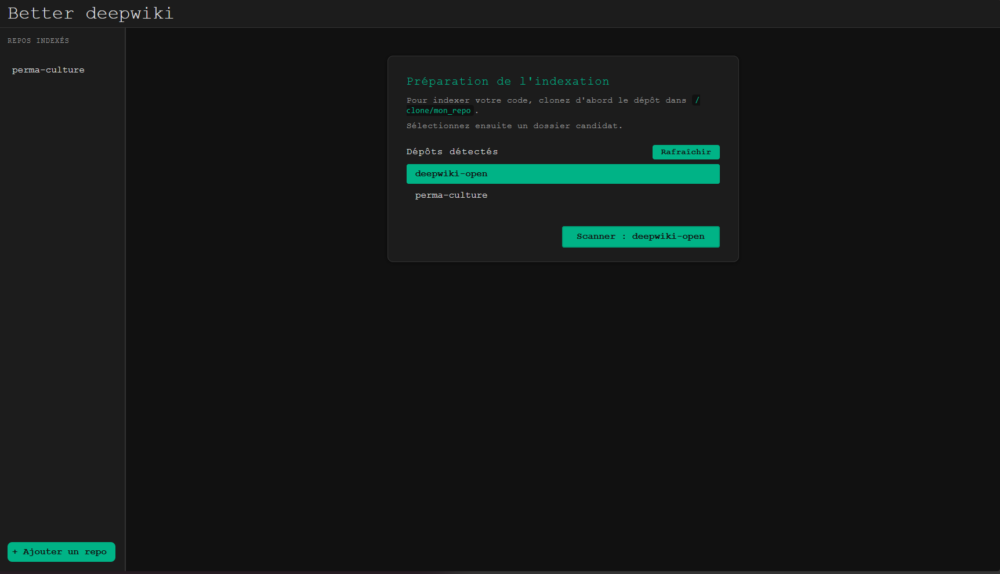
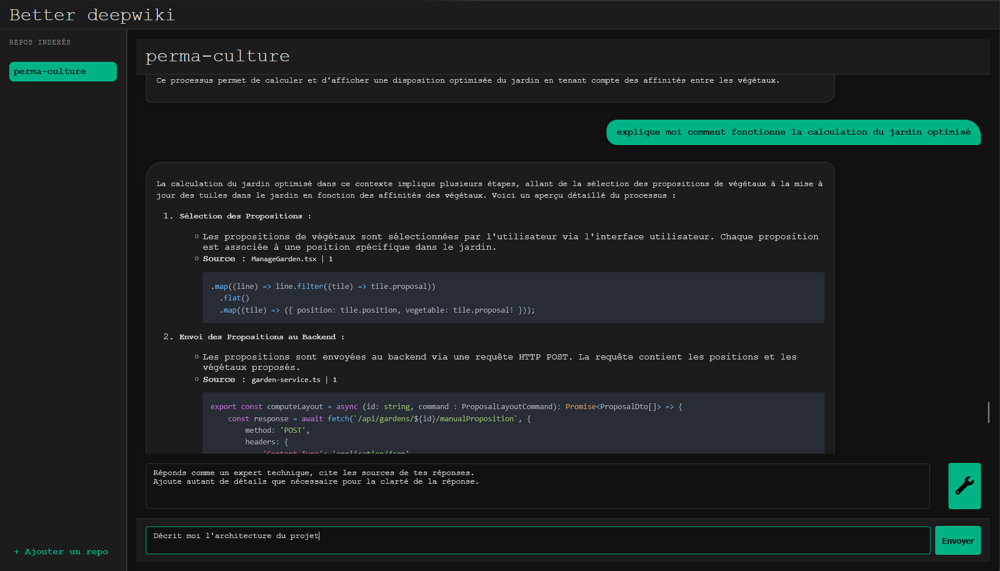

# Better DeepWiki — Quick‑Start Guide

> **Purpose** — Better DeepWiki is a minimalist, opinionated Rust rewrite of *deepwiki‑open*. It enriches source code with Retrieval‑Augmented Generation (RAG) so that professional developers can ask high‑fidelity questions about any Git repository.

---

## 1 · Prerequisites

| Tool | Recommended Version | Purpose |
|------|---------------------|---------|
| **Rust** | stable ≥ 1.77 | Compiles the `better-deep-wiki` binary |
| **Node.js + npm** | ≥ 20.x | Runs the React frontend |
| **Docker** | ≥ 24.x | Runs Qdrant (vector database) |
| **Qdrant** | image `qdrant/qdrant` | Stores embeddings |
| **MistralAI API key** | — | Generates embeddings & answers |

---

## 2 · Launch Qdrant Locally

```bash
docker volume create qdrant_data
docker run \
    -p 6333:6333 -p 6334:6334 \
    -v qdrant_data:/qdrant/storage \
    qdrant/qdrant
```

---

## 3 · Configure the Backend

1. Duplicate the example env file:
   ```bash
   cp .env.bak .env
   ```
2. Edit `.env` and set your Mistral API key:
   ```env
   MISTRAL_API_KEY="your-mistral-key"
   ```

---

## 4 · Prepare the Repository to Analyse

Clone (or copy) your target repository into the `clone/` directory at the project’s root:

```bash
git clone git@github.com:acme/repo_test.git clone/repo_test
```

---

## 5 · Start the Application

**Backend (Rust)**
```bash
cargo run
```

**Frontend (React)**
```bash
cd frontend
npm install
npm run dev
```

The web UI is now accessible at http://localhost:5173.

---

## 6 · How to Use

### **Step 1 — Index a Repository**

- On the web UI, select a repository present in `/clone/` and start the indexing process.
- The interface shows progress and confirms when embedding is done.

<p align="center">
  
</p>

---

### **Step 2 — Ask Questions**

- Once the repository is indexed, type your questions into the prompt area.
- Answers are generated using context from your codebase.

<p align="center">
  
</p>

---

## 7 · Troubleshooting

| Symptom | Likely Cause |
|---------|--------------|
| `connection refused: 6333` | Qdrant container is not running |
| API *rate limit* errors | Reduce usage or check your API quota |
| Repository not listed | Ensure your repo is present in the `/clone/` directory |

---

## 8 · Philosophy & Limitations

Better DeepWiki follows the *Unix philosophy*: a single, explicit workflow with minimal hidden behaviour. No internal repo cloning. One repo = one indexation.

---

## 9 · Licence

MIT — see `LICENSE`.

---

*Happy hacking!* 🚀
